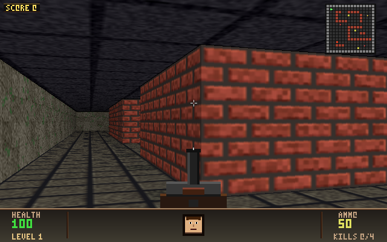
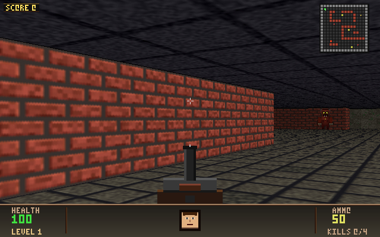

# doom-clone

A minimal DOOM-style raycasting FPS. Available as two implementations that
share the same gameplay, renderer, levels, bot, and self-test:

- **C** (`doom.c`) — a single translation unit. Compiles for **Windows**
  (ARM64 / x64 / x86, Win32 + GDI), **Linux / WSL** (X11), and **macOS**
  (X11 via XQuartz); the platform layer is selected with `#ifdef _WIN32`.
- **Rust** (`src/`, `Cargo.toml`) — a faithful port organized as a modular
  Cargo crate, using the [`minifb`](https://crates.io/crates/minifb) crate for
  the cross-platform window + framebuffer. See [Rust build](#rust).

Verified building and running on aarch64 Ubuntu 24.04 (WSLg) — both
windowed and `--headless` modes exit cleanly.

## Controls

| Key | Action |
| --- | --- |
| `W` / Up arrow | Move forward |
| `S` / Down arrow | Move backward |
| `A` / `D` | Strafe left / right |
| Left / Right arrow | Turn |
| `Space` | Shoot |
| `R` | Restart (after death) |
| `Esc` | Quit |

## Features

- DDA raycasting with distance shading and bilinear-filtered procedural textures
- Smooth, velocity-based player movement with acceleration and friction
- Imp-style enemy that chases and melees you
- Pistol with muzzle flash + ammo counter
- HUD (health, ammo), crosshair, death/win banners
- Movement-driven weapon bob for visual feedback
- Built-in AI bot (`--bot`) that pathfinds, fights, and clears all five levels
- Self-test mode (`--selftest`) that validates level geometry and reachability

## Screenshots

Smooth bilinear-filtered textures (walls, floor, ceiling) and responsive player control:

| | |
|---|---|
|  |  |

Textures are procedurally generated with detail (brick mortar, stone cracks, metal rivets, wood grain) and smoothly interpolated to eliminate the blocky nearest-neighbor look. Player movement eases in/out instead of snapping.

## Building

### Windows ARM64 / x64 (MSVC)

1. Install Visual Studio 2022 with the matching MSVC C++ build tools
   (ARM64 or x64).
2. Open the matching **Native Tools Command Prompt for VS 2022**.
3. `cd` into this folder and run `build.bat` — the same file builds
   ARM64 from the ARM64 prompt and x64 from the x64 prompt.

Alternative with clang: `build-clang.bat`.

### Windows x86 (MSVC)

Open the **x86 Native Tools Command Prompt for VS 2022** and run:

```
build-x86.bat
```

Or with clang from any prompt: `build-x86-clang.bat`
(needs the `i686-pc-windows-msvc` target available in your LLVM toolchain).

### Linux / WSL (any arch with X11)

```
./build-linux.sh
./doom            # windowed
./doom --headless --frames 120   # smoke test
```

Requires `libx11-dev` (`sudo apt install libx11-dev` on Debian/Ubuntu).

## Rust

The Rust port lives alongside the C source as a Cargo crate (`src/`,
`Cargo.toml`) and builds the same `doom` binary with the same flags. It uses
the cross-platform `minifb` crate for windowing, so it runs on Linux/Windows/
macOS without per-platform code.

```
cargo run --release                       # windowed
cargo run --release -- --headless --frames 120   # smoke test
cargo run --release -- --selftest         # validate levels
cargo run --release -- --bot              # watch the AI play
```

The code is split into focused modules: `render` (raycaster), `sprites`,
`hud`, `entity` (game logic), `textures`, `level`, `audio`, `bot`, `selftest`,
and `game` (the central state). The C globals become one `Game` struct.

Notes:
- Run with `--release`; the debug build's per-pixel work is much slower.
- On Linux, minifb is built **x11-only** (`default-features = false`,
  `features = ["x11"]`). This avoids the Wayland dependency chain (which pulls a
  `getrandom` that needs a very recent toolchain) and needs no X11 dev packages
  (X11 is loaded at runtime via `dlopen`). X11/XWayland covers Linux and WSLg.
- `Cargo.lock` is kept at format v3 so older Cargo (back to ~1.75) can read it.
- Audio uses the same external-player approach as the C version on Unix
  (`paplay`/`aplay`/`play`/`sox`); native Windows `waveOut` is not ported, so
  audio is silent on Windows. Headless runs skip audio entirely.

## Command-line flags

| Flag | Effect |
| --- | --- |
| `--headless` | Run the simulation with no window (uses a fixed 60 Hz timestep). |
| `--frames N` | Stop after `N` frames (handy with `--headless`/`--bot`). |
| `--bot` | Let the built-in AI play. Works windowed (watch it) or headless. |
| `--selftest` | Validate every level (geometry, spawns, reachability) and exit 0/1. |

### Bot (AI player)

`--bot` hands the controls to an AI that reads the world state and drives the
same keys a human would. It BFS-pathfinds around walls, only fires when it has
line of sight, manages range (closes on far targets, backs off meleeing
grunts), dodges fireballs, grabs health/ammo when low, and auto-restarts for an
endless attract-mode demo. Examples:

```
./doom --bot                              # watch it play in a window
./doom --headless --bot --frames 10800    # 3 min of play, prints score per second
```

### macOS (X11 via XQuartz)

1. Install [XQuartz](https://www.xquartz.org/) (provides `/opt/X11`).
2. (Optional) `brew install sox` to enable audio.
3. Build and run:

   ```
   ./build-macos.sh
   open -a XQuartz       # start X server
   ./doom
   ```

Works on Apple Silicon and Intel.

## Audio

The game synthesizes effects in software and pipes raw PCM to the OS:

- **Windows**: native `waveOut*` (linked via `winmm.lib`).
- **Linux**: tries `paplay`, then `aplay`.
- **macOS / BSD**: tries `play`, then `sox` (install via `brew install sox`).

If none of those are available, audio silently disables.

## Files

- `doom.c` — entire game in one translation unit
- `build.bat` — MSVC build for ARM64 / x64 Windows
- `build-clang.bat` — clang build for ARM64 / x64 Windows
- `build-x86.bat` — MSVC build for Windows x86
- `build-x86-clang.bat` — clang `-m32` build for Windows x86
- `build-linux.sh` — gcc build for Linux/WSL
- `build-macos.sh` — clang build for macOS (XQuartz)

## Architecture notes

- Game logic (raycasting, sprite rendering, HUD, input handling) is fully
  platform-agnostic and writes into a 640×400 32bpp framebuffer.
- The platform layer creates a window, blits the framebuffer, and
  translates raw key events into a small set of game-defined actions
  (`K_FWD`, `K_TURNL`, `K_SHOOT`, …).
- Win32 backend uses `StretchDIBits` for blitting; X11 backend uses
  `XPutImage`. Both upscale the 640×400 frame to a 1280×800 window.
- Timing uses `QueryPerformanceCounter` on Windows and
  `clock_gettime(CLOCK_MONOTONIC)` on POSIX; frame delta is clamped to
  50 ms for stability.
- No architecture-specific intrinsics, so the same source compiles
  unmodified on x64 and ARM64.

## Test runs (verified)

```
# On aarch64 Ubuntu 24.04 (WSLg):
$ ./build-linux.sh
Build OK: ./doom ...
$ ./doom --headless --frames 120 && echo OK
OK
$ ./doom --frames 60      # opens X11 window, runs ~1s, clean exit
```
