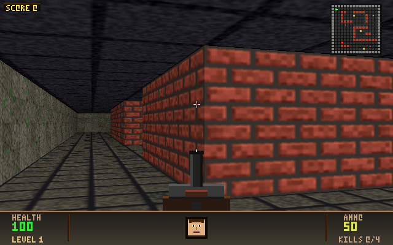
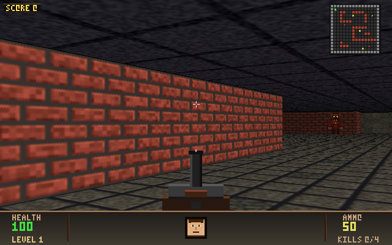
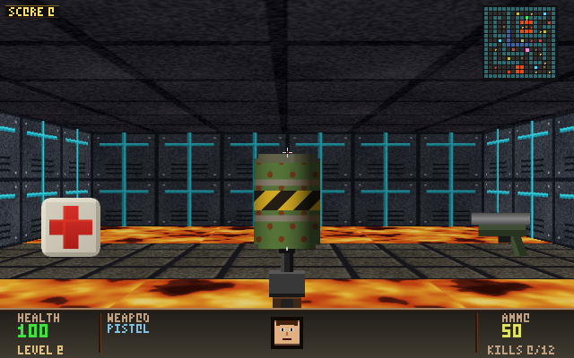
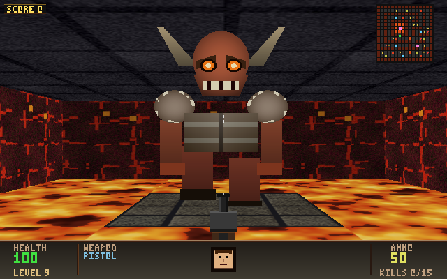

# doom-clone

A minimal DOOM-style raycasting FPS written in Rust. It uses the
[`minifb`](https://crates.io/crates/minifb) crate for a cross-platform window +
framebuffer, so the same code runs on Linux/Windows/macOS without per-platform
code.

Verified building and running on aarch64 Ubuntu 24.04 (WSLg) — both windowed
and `--headless` modes exit cleanly.

## Controls

| Key | Action |
| --- | --- |
| `W` / Up arrow | Move forward |
| `S` / Down arrow | Move backward |
| `A` / `D` | Strafe left / right |
| Left / Right arrow | Turn |
| `Space` | Shoot |
| `R` | Restart (after death) |
| `Esc` | Quit |

## Features

- DDA raycasting with distance shading and bilinear-filtered procedural textures
- Smooth, velocity-based player movement with acceleration and friction
- Nine levels that escalate: plain corridors early, then lava, barrels and
  heavier demons in the back half
- Four enemy kinds — grunt (charges and melees), imp (keeps its distance and
  throws fireballs), wraith (fast, translucent, spirals in), baron (armoured
  bruiser with a three-way fireball fan)
- Environment hazards: lava floor that burns you, and fuel barrels that chain
  detonate — good for clearing a pack, bad if you pop one at your feet
- Three weapons (pistol / shotgun / rifle) found as pickups, muzzle flash + ammo
- HUD (health, ammo, weapon), kind-coloured minimap, crosshair, death/win banners
- Movement-driven weapon bob for visual feedback
- Built-in AI bot (`--bot`) that pathfinds, fights, grabs guns, and routes
  around lava
- Self-test mode (`--selftest`) that validates level geometry and reachability

## Screenshots

Smooth bilinear-filtered textures (walls, floor, ceiling) and responsive player control:

| | |
|---|---|
|  |  |

Textures are procedurally generated with detail (brick mortar, stone cracks, metal rivets, wood grain) and smoothly interpolated to eliminate the blocky nearest-neighbor look. Player movement eases in/out instead of snapping.

The later levels add lava floors and fuel barrels, and a couple of heavier demons:

| | |
|---|---|
|  |  |

Left: the level 8 furnace — the rifle and medkit are behind a lava crossing, with a barrel parked between them. Right: the level 9 core, where a baron holds the one dry tile in a ring of fire.

## Building & running

Needs a Rust toolchain ([rustup](https://rustup.rs/)); no system X11 dev
packages are required.

```
cargo run --release                              # windowed
cargo run --release -- --headless --frames 120   # smoke test
cargo run --release -- --selftest                # validate levels
cargo run --release -- --bot                     # watch the AI play
```

The code is split into focused modules: `render` (raycaster), `sprites`,
`hud`, `entity` (game logic), `textures`, `level`, `audio`, `bot`, `selftest`,
and `game` (the central `Game` struct that holds all state).

Notes:
- Run with `--release`; the debug build's per-pixel work is much slower.
- On Linux, minifb is built **x11-only** (`default-features = false`,
  `features = ["x11"]`). This avoids the Wayland dependency chain (which pulls a
  `getrandom` that needs a very recent toolchain) and needs no X11 dev packages
  (X11 is loaded at runtime via `dlopen`). X11/XWayland covers Linux and WSLg.
- `Cargo.lock` is kept at format v3 so older Cargo (back to ~1.75) can read it.

## Command-line flags

| Flag | Effect |
| --- | --- |
| `--headless` | Run the simulation with no window (uses a fixed 60 Hz timestep). |
| `--frames N` | Stop after `N` frames (handy with `--headless`/`--bot`). |
| `--bot` | Let the built-in AI play. Works windowed (watch it) or headless. |
| `--selftest` | Validate every level (geometry, spawns, reachability, capacity) and exit 0/1. |
| `--shot PATH` | Render one frame to a binary PPM and exit (renderer checks). |
| `--shot-level N` | Which level `--shot` renders (0-based). |
| `--shot-pos X,Y` | Put the `--shot` camera at a map position instead of the spawn. |
| `--shot-angle DEG` | Face the `--shot` camera in a given direction. |

### Bot (AI player)

`--bot` hands the controls to an AI that reads the world state and drives the
same keys a human would. It BFS-pathfinds around walls, ranks goals by *path*
distance (straight-line distance makes it yo-yo in a maze), only fires when it
has line of sight, manages range (closes on far targets, backs off meleeing
grunts), dodges fireballs, grabs health/ammo when low, detours for a gun it
doesn't own yet, routes around lava unless the only way through is over it, and
auto-restarts for an endless attract-mode demo. Examples:

```
cargo run --release -- --bot                            # watch it play in a window
cargo run --release -- --headless --bot --frames 10800  # 3 min of play, prints score per second
```

## Audio

The game synthesizes effects in software and pipes raw PCM to an external
player:

- **Linux**: tries `paplay`, then `aplay`.
- **macOS / BSD**: tries `play`, then `sox` (install via `brew install sox`).

If none of those are available — including on Windows, which has no native
backend here — audio silently disables. Headless runs skip audio entirely.

## Architecture notes

- Game logic (raycasting, sprite rendering, HUD, input handling) is fully
  platform-agnostic and writes into a 640×400 32bpp framebuffer.
- `minifb` owns the platform layer: it creates the window, blits the
  framebuffer (upscaled to 1280×800), and surfaces key events, which are
  translated into a small set of game-defined actions.
- All shared game state lives in one `Game` struct rather than scattered
  globals.
- Frame delta is clamped for stability so the simulation stays sane across
  hitches.

## Test runs (verified)

```
# On aarch64 Ubuntu 24.04 (WSLg):
$ cargo run --release -- --headless --frames 120 && echo OK
OK
$ cargo run --release -- --frames 60   # opens window, runs ~1s, clean exit
```
